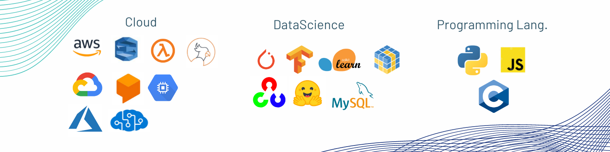

<h1>Hey! I am Momal Ijaz </a></h1>

<h3> What I do? 👩‍💻 </h3>
I am a data scientist and like to work across it's sub-domains including Deep Learning, Computer Vision and Natural Language Processing.

Computer Vision 👁️ 

<ul>
  <li><a href="https://github.com/Momilijaz96/Face-DTR">Face-Detection-Recognition-Tracking</a></li>
  <li><a href="https://github.com/Momilijaz96/LPN-LightWeightPoseNetwork-">LightWeight-Human-Pose-Estimator</a></li>
  <li><a href="https://github.com/Momilijaz96/Fall-Detection/tree/main-">Fall-Detection</a></li>
  <li><a href="https://github.com/Momilijaz96/CannyEdgeDetection">CannyEdgeDetection</a></li>
  <li>More projects coming soon...</li>
</ul>

 Deep Learning 🔥

<ul>
  <li><a href="https://github.com/Momilijaz96/AlphaFold-V1-PyTorch">Protien-Folding-Prediction-AlphaFold-V1-Pytorch</a></li>
  <li><a href="https://github.com/Momilijaz96/FC-Convolution-AutoEncoder">AutoEncoders</a></li>
  <li><a href="https://github.com/Momilijaz96/PyTorch-Model-Architecture-Tuning">PyTorch-Models-Architecture-Tuning</a></li>
  <li>More projcets coming soon...</li>
</ul>

